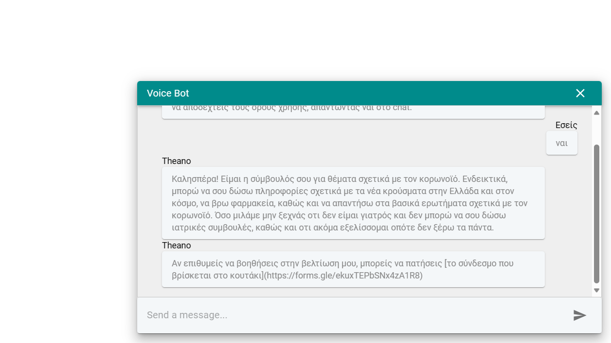

# React Rasa Widget

## Setup

To use the widget with your Rasa server you need to set up the server address at: `src/services/sendMessage.ts`.

## Run

Use `npm run dev`.

## Build

Use `npm run build`.
